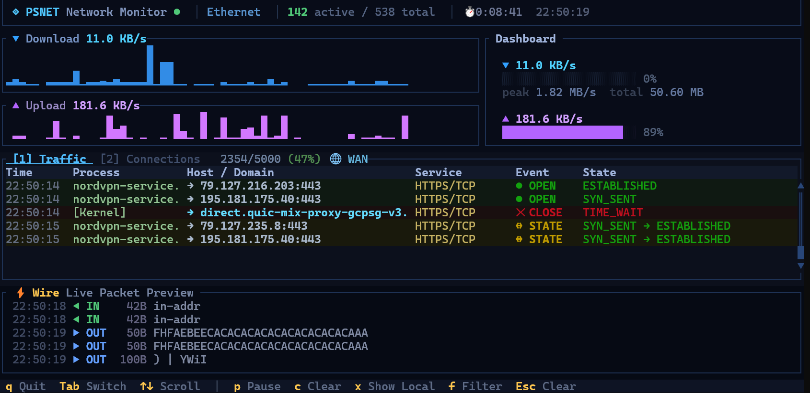

<p align="center">
  
  
  
  
  <a href="https://crates.io/crates/psnet"></a>
  <a href="https://community.chocolatey.org/packages/psnet"></a>
  <a href="https://github.com/microsoft/winget-pkgs/tree/master/manifests/m/marlocarlo/psnet"></a>
</p>

<h1 align="center">
  ◈ PSNET
</h1>

<p align="center">
  <strong>A beautiful real-time network monitor for your terminal.</strong>
  <br>
  <em>See every connection. Know every domain. Watch the wire.</em>
</p>

<p align="center">
  <a href="#features">Features</a> •
  <a href="#installation">Install</a> •
  <a href="#usage">Usage</a> •
  <a href="#keybindings">Keys</a> •
  <a href="#screenshots">Screenshots</a> •
  <a href="#architecture">Architecture</a> •
  <a href="#contributing">Contributing</a>
</p>

---

## What is PSNET?

**PSNET** is a zero-dependency (no Npcap/WinPcap needed) TUI network monitor built in Rust for Windows PowerShell. It gives you real-time visibility into everything happening on your network — live speed graphs, active connections with DNS-resolved hostnames, a Wireshark-like traffic event log, and a raw packet wire preview — all in a beautiful terminal interface.

Think **Wireshark meets htop**, but for your terminal.

```
┌─ ◈ PSNET Network Monitor ⚡ │ Ethernet │ 42 active / 127 total │ ⏱ 0:15:32 ─┐
│                                                                                 │
├─ ▼ Download 2.45 MB/s ──────────────────┬─ Dashboard ──────────────────────────┤
│  ▁▂▃▅▇█▇▆▄▃▂▁▁▂▃▆█▇▅▃▂▁▁▂▅▇█▇▅▃▂     │  ▼  2.45 MB/s                       │
│                                         │  ████████████░░░░░░░░ 62%            │
├─ ▲ Upload 156.2 KB/s ──────────────────┤  peak 4.12 MB/s  total 1.24 GB       │
│  ▁▁▁▂▃▂▁▁▁▂▃▂▁▁▁▂▃▃▂▁▁▁▂▃▂▁▁▁▂▃     │                                       │
│                                         │  ▲  156.2 KB/s                       │
│                                         │  ████░░░░░░░░░░░░░░░░ 18%            │
│                                         │  peak 892.1 KB/s  total 48.2 MB      │
├─ [1] Traffic  [2] Connections ──────────┴──────────────────────────────────────┤
│  Time      Process          Host / Domain                Service    Event       │
│  17:04:52  chrome.exe       → github.com:443             HTTPS/TCP  ● OPEN      │
│  17:04:52  Discord.exe      → discord.gg:443             HTTPS/TCP  ● OPEN      │
│  17:04:53  Code.exe         → api.github.com:443         HTTPS/TCP  ↔ STATE     │
│  17:04:54  spotify.exe      → audio-ak.spotify.com:443   HTTPS/TCP  ● OPEN      │
│  17:04:55  chrome.exe       → fonts.googleapis.com:443   HTTPS/TCP  ✕ CLOSE     │
├─ ⚡ Wire  Live Packet Preview ────────────────────────────────────────────────┤
│  17:04:52 ◀ IN   2K  HTTP/1.1 200 OK\nContent-Type: text/html; charset=utf-8  │
│  17:04:53 ▶ OUT  1K  GET /api/v1/repos HTTP/1.1\nHost: api.github.com\nAccept  │
│  17:04:53 ◀ IN  12K  {"id":12345,"name":"psnet","full_name":"user/psnet","...  │
│  17:04:54 ▶ OUT 256  POST /track HTTP/1.1\nContent-Length: 128\nContent-Type:   │
├─────────────────────────────────────────────────────────────────────────────────┤
│ q Quit  Tab Switch  ↑↓ Scroll  │  p Pause  c Clear  x Show Local  f Filter     │
└─────────────────────────────────────────────────────────────────────────────────┘
```

## Screenshots

<p align="center">
  
</p>

---

## Features

### 📊 Live Speed Monitoring
- **Sparkline graphs** — smooth Unicode waveforms that flow like a live EKG
- **Download** (blue) and **Upload** (purple) tracked separately
- **Gauge bars** showing current speed as percentage of peak
- **Dynamic colors** — sparklines brighten as speed increases
- Peak speed, current speed, and total transferred data at a glance

### 🔗 Smart Connection Table
- **DNS-resolved hostnames** — see `github.com` instead of `140.82.121.4`
- **Service labels** — `HTTPS/TCP`, `DNS/UDP`, `SSH/TCP` instead of raw port numbers
- **Color-coded by service** — HTTPS=green, HTTP=yellow, DNS=blue, SSH=purple
- **State-aware sorting** — ESTABLISHED connections first, LISTEN/TIME_WAIT dimmed
- **Localhost filter** — hide the noise of 127.0.0.1 loopback traffic (toggle with `x`)
- **Live filtering** — type to search by process name, hostname, port, or service
- **Process names** — see which app owns each connection

### 🌊 Traffic Event Log (Wireshark-style)
- **Real-time connection lifecycle** — see connections OPEN, CLOSE, and STATE changes as they happen
- **Browser Network-tab layout** — Host/Domain as the primary column
- **5,000 event buffer** — oldest events automatically roll off (buffer usage shown in title bar)
- **Color-coded events** — green for OPEN, red for CLOSE, yellow for STATE changes
- Pause, filter, scroll through history

### ⚡ Wire Preview (Packet Sniffer)
- **Real packet payload inspection** — see actual HTTP headers, JSON responses, protocol handshakes flowing through your network in real time
- **Smart ASCII extraction** — binary/encrypted data filtered out, readable text highlighted
- **Content-aware coloring** — HTTP requests (green), JSON (cyan), HTML (yellow), protocol headers (purple)
- **Direction indicators** — `◀ IN` / `▶ OUT` with byte sizes
- **No external dependencies** — uses Windows raw sockets (requires Administrator for this feature)

### 🎨 Beautiful Dark Theme
- Consistent deep navy palette across all panes
- Unicode box-drawing characters for clean borders
- Activity indicator in title bar (⚡ lightning for high throughput)
- Refined status bar with golden keybind highlights

### 🔍 DNS Resolution
- Reads the **Windows DNS cache** automatically — no extra network traffic
- Dual approach: fast API call every tick + `ipconfig /displaydns` parsing for completeness
- 35+ well-known port labels (HTTPS, HTTP, DNS, SSH, RDP, MySQL, PostgreSQL, Redis, etc.)

## Installation

### Via Cargo

```powershell
cargo install psnet

# Then run from anywhere
psnet
```

### Via Chocolatey

```powershell
choco install psnet

# Then run from anywhere
psnet
```

### Via WinGet

```powershell
winget install marlocarlo.psnet

# Then run from anywhere
psnet
```

### Download Binary

Grab the latest `psnet.exe` directly from [GitHub Releases](https://github.com/marlocarlo/psnet/releases/latest) — no installation needed. Just download, place it in your PATH, and run.

### From Source

```powershell
# Clone the repository
git clone https://github.com/marlocarlo/psnet.git
cd psnet

# Build optimized release binary
cargo build --release

# Run it
.\target\release\psnet.exe
```

### Requirements

- **Windows 10/11** (uses Win32 APIs for connection tracking)
- **Rust 1.70+** for building
- **Administrator privileges** (optional, enables the Wire packet preview pane)

## Usage

```powershell
# Basic usage
psnet

# For packet inspection (Wire preview), run as Administrator
# Right-click PowerShell → "Run as Administrator"
psnet
```

The app starts on the **Traffic** tab by default. Press `Tab` to switch to the **Connections** view. The speed graphs and wire preview are always visible.

### Running as Administrator

The Wire preview pane (bottom) captures raw packets to show you actual data flowing through your network.
This requires Administrator privileges. Without admin, the Wire pane shows a friendly message:

```
⚠ SIO_RCVALL failed (requires Administrator privileges)  │  Run as Administrator to enable packet inspection
```

Everything else works perfectly without admin.

## Keybindings

### Global

| Key | Action |
|-----|--------|
| `q` | Quit |
| `Ctrl+C` | Quit |
| `Tab` | Switch between Traffic / Connections tabs |
| `↑` `↓` | Scroll |
| `PgUp` `PgDn` | Scroll fast (20 lines) |
| `Home` `End` | Jump to top / bottom |

### Traffic Tab

| Key | Action |
|-----|--------|
| `p` | Pause / Resume live capture |
| `c` | Clear the event log |
| `x` | Toggle localhost filter (WAN only / ALL) |
| `f` + typing | Filter events by process, host, port |
| `Esc` | Clear filter |

### Connections Tab

| Key | Action |
|-----|--------|
| `1`-`5` | Sort by column (Process, Host, Service, State, Local) |
| `l` | Toggle LISTEN connections on/off |
| `x` | Toggle localhost filter |
| `f` + typing | Filter connections |
| `Esc` | Clear filter |

## How It Works

PSNET combines multiple Windows APIs and techniques to give you a complete picture of your network activity — all without requiring external packet capture drivers.

### Connection Tracking
Uses `GetExtendedTcpTable` and `GetExtendedUdpTable` from `iphlpapi.dll` to enumerate all TCP and UDP connections system-wide, including the owning process ID for each.

### Process Resolution
Resolves process names via `QueryFullProcessImageNameW` from `kernel32.dll`, with a `sysinfo` crate fallback. Failed lookups are retried every tick rather than cached permanently.

### DNS Resolution
Dual-source approach:
1. **Fast path**: `DnsGetCacheDataTable` + `DnsQuery_W` from `dnsapi.dll` — reads the OS DNS resolver cache directly (every tick)
2. **Thorough path**: Parses `ipconfig /displaydns` output (every 10 ticks) — catches entries the API might miss

### Traffic Events
Diff-based detection: each tick, the current connection set is compared to the previous tick's snapshot. New connections emit `OPEN`, disappeared connections emit `CLOSE`, and state changes (e.g., `SYN_SENT → ESTABLISHED`) emit `STATE` events.

### Packet Sniffing
Raw socket with `SIO_RCVALL` (promiscuous mode) captures IP packets on the primary interface. The sniffer:
1. Parses IP + TCP/UDP headers to extract source/destination
2. Skips to the payload offset
3. Extracts printable ASCII characters (collapsing binary runs)
4. Filters out packets with too little readable content
5. Stores snippets in a lock-free ring buffer for the UI

### Buffer Management
The traffic event log maintains a **rolling buffer of 5,000 events**. When the buffer is full, the oldest events are automatically removed to make room for new ones. The title bar shows buffer usage like `2,847/5,000 (57%)` with color coding:
- **Green** — under 70% capacity
- **Yellow** — 70-90% capacity  
- **Red** — over 90% capacity

The Wire preview keeps the most recent **200 packet snippets**.

## Architecture

```
psnet/
├── Cargo.toml
└── src/
    ├── main.rs              # Entry point, event loop, terminal setup
    ├── app.rs               # Application state, input handling, update logic
    ├── types.rs             # Shared types (Connection, TrafficEntry, etc.)
    ├── utils.rs             # Formatting helpers (speed, bytes, ntohs)
    ├── network/
    │   ├── mod.rs
    │   ├── speed.rs         # Network speed calculation via sysinfo
    │   ├── connections.rs   # Win32 FFI for TCP/UDP table enumeration
    │   ├── dns.rs           # Windows DNS cache reader + service port map
    │   ├── capture.rs       # Traffic event tracker (diff-based)
    │   └── sniffer.rs       # Raw socket packet sniffer
    └── ui/
        ├── mod.rs           # Master layout
        ├── title.rs         # Title bar with activity indicator
        ├── speed.rs         # Sparkline graphs + dashboard
        ├── connections.rs   # Connection table
        ├── capture.rs       # Traffic event log
        ├── packets.rs       # Wire preview pane
        └── status.rs        # Keybinding status bar
```

### Dependencies

| Crate | Purpose |
|-------|---------|
| [ratatui](https://github.com/ratatui/ratatui) 0.29 | Terminal UI framework |
| [crossterm](https://github.com/crossterm-rs/crossterm) 0.28 | Cross-platform terminal I/O |
| [sysinfo](https://github.com/GuillaumeGomez/sysinfo) 0.32 | Network interface byte counters |
| [chrono](https://github.com/chronotope/chrono) 0.4 | Timestamp formatting |

No packet capture drivers. No Npcap. No WinPcap. **Zero external runtime dependencies.**

## FAQ

**Q: Why Windows only?**  
A: PSNET uses Windows-specific APIs (`iphlpapi.dll`, `dnsapi.dll`, `ws2_32.dll`, `kernel32.dll`) for deep system integration. This gives it capabilities that cross-platform abstractions can't match — like reading the OS DNS cache and enumerating connections with process ownership.

**Q: Do I need to install Npcap/WinPcap?**  
A: No! The main features (connections, DNS, traffic events, speed graphs) use built-in Windows APIs. The Wire preview uses raw sockets which are also built-in — just needs Administrator privileges.

**Q: Why do some connections show IP addresses instead of hostnames?**  
A: PSNET reads hostnames from the Windows DNS cache. If a connection was established before PSNET started, or if the DNS entry has expired from the cache, it will show the raw IP. Over time, as DNS queries happen, more hostnames will appear.

**Q: What does the buffer percentage mean?**  
A: The traffic event log keeps the last 5,000 events. The percentage shows how full the buffer is. At 100%, old events are automatically removed as new ones arrive — you never lose new data.

**Q: Why isn't the Wire preview showing anything?**  
A: The Wire preview requires Administrator privileges. Right-click PowerShell → "Run as Administrator" → run `psnet`. Also, encrypted traffic (HTTPS/TLS) will be filtered out since it's not readable ASCII.

## Built With Love

PSNET is a passion project. If you find it useful, consider:
- ⭐ **Starring** this repository
- 🐛 **Reporting bugs** via GitHub Issues
- 🔧 **Contributing** improvements via Pull Requests
- 📢 **Sharing** with fellow developers

## Contributing

Contributions are welcome! Here are some areas where help would be great:

- 🐧 **Linux/macOS support** — replacing Win32 FFI with platform-specific equivalents
- 📊 **Per-process bandwidth tracking** — showing which app is using the most bandwidth
- 💾 **Export** — save traffic logs to CSV/JSON
- 🎨 **Themes** — configurable color schemes
- 📦 **Package managers** — available on Cargo, Chocolatey, and WinGet

## License

MIT License — see [LICENSE](LICENSE) for details.

---

<p align="center">
  <strong>◈ PSNET</strong> — See your network. Understand your network.
  <br><br>
  <em>Built with Rust 🦀 and love for the terminal.</em>
</p>
